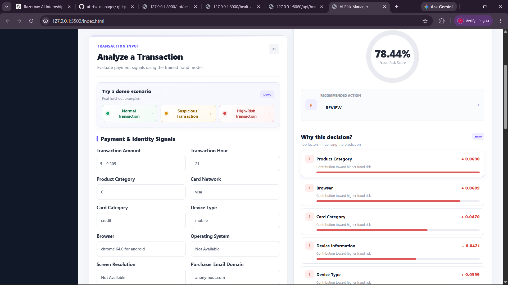
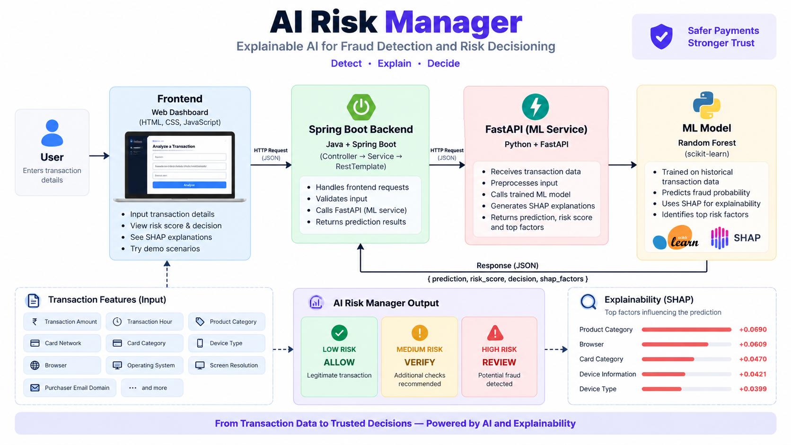

# 🛡️ AI Risk Manager

### Explainable AI-Powered Fraud Detection & Risk Decisioning System

An end-to-end AI fraud risk assessment platform that analyzes payment transaction signals, estimates fraud probability, explains the prediction using SHAP, and converts the result into an actionable risk decision.

**LOW → ALLOW | MEDIUM → VERIFY | HIGH → REVIEW**

---

## 🖥️ Dashboard

---

## 🚀 Overview

AI Risk Manager is a defense-only fraud detection and risk decisioning system.

Instead of producing only a binary fraud prediction, the system provides:

- 🎯 Fraud probability
- 🚦 Risk level
- ⚡ Recommended action
- 🔍 Explainable AI reasons
- 📊 Risk-based decisioning
- ⚡ Transaction velocity signals
- 📚 Historical behaviour signals
- 💻 Device / identity signals
- 💳 Payment and card signals
- 📈 Held-out model evaluation
- 💰 False-positive cost analysis

The project combines **Machine Learning, Explainable AI, Spring Boot, FastAPI and an interactive frontend** into one end-to-end system.

---

# 🎯 Problem

Payment fraud detection is challenging because fraudulent transactions are rare compared with legitimate transactions.

A practical fraud detection system must balance two objectives:

### Catch fraudulent transactions

while minimizing:

### False positives on legitimate customers

A system with extremely high recall may incorrectly challenge many legitimate transactions.

A system with an extremely low false-positive rate may miss too much fraud.

Therefore, AI Risk Manager treats fraud detection as a **risk decisioning problem**, rather than simply a binary classification problem.

---

# 💡 Solution

The system follows this pipeline:

Transaction
     ↓
Feature Engineering
     ↓
Random Forest ML Model
     ↓
Fraud Probability
     ↓
Risk Decision Engine
     ↓
ALLOW / VERIFY / REVIEW
     ↓
SHAP Explanation

---

# ⭐ Key Features

## 1. AI Fraud Risk Scoring

The machine learning model estimates the probability that a transaction is fraudulent.

Example:

Fraud Probability: 87.43%
Risk Level: HIGH
Action: REVIEW
2. Risk-Based Decision Engine

The fraud probability is converted into an operational decision.

Fraud Probability	Risk Level	Action
< 40%	🟢 LOW	ALLOW
40% – <70%	🟡 MEDIUM	VERIFY
≥ 70%	🔴 HIGH	REVIEW

This separates the machine-learning prediction from the business decision layer.

🧠 ML Signals

The model combines several categories of signals.

💳 Transaction Signals
Transaction amount
Log transaction amount
Product category
Transaction hour
Transaction day
⚡ Velocity Signals

The system calculates transaction activity using information available before the current transaction.

Features include:

Transactions in the last 10 minutes
Transactions in the last hour
Amount spent in the last hour
📚 Historical Behaviour

The system derives:

Previous transaction count
Previous average transaction amount
Previous maximum transaction amount
Current amount compared with previous average
💻 Device / Identity Signals

Available identity-related information includes:

Device type
Device information
Operating system
Browser
Screen resolution
Identity-signal availability

These are treated as device/identity signals rather than assuming that any single field uniquely identifies a device.

💳 Payment Signals

The model also considers:

Card attributes
Card type
Product category
Address information
Distance-related information
Purchaser email domain
Recipient email domain
🔍 Explainable AI with SHAP

A fraud probability alone does not explain the decision.

AI Risk Manager uses SHAP (SHapley Additive exPlanations) to identify the features contributing most strongly to an individual prediction.

The dashboard presents explanations such as:

🔴 ProductCD
   Higher Risk

🔴 DeviceType
   Higher Risk

🟢 PreviousAverageAmount
   Lower Risk

This allows an analyst to understand:

Why was this transaction considered risky?

SHAP values represent feature contribution to the model output and are not percentages.

🤖 Machine Learning Model

The current implementation uses a:

Random Forest Classifier

Configuration:

n_estimators = 100
max_depth = 15
min_samples_leaf = 5
class_weight = balanced
random_state = 42
n_jobs = -1

The ML pipeline preprocesses numerical and categorical features before classification.

Class balancing is used because fraudulent transactions represent a minority class.

🛠️ Feature Engineering

The system generates additional features before training.

Transaction Features
TransactionHour
TransactionDay
LogTransactionAmt
Velocity Features
TransactionsLast10Min
TransactionsLast1Hour
AmountLast1Hour
Historical Behaviour
PreviousTransactionCount
PreviousAverageAmount
PreviousMaxAmount
CurrentAmountVsPreviousAverage
Identity Completeness
DeviceInfoAvailableCount
DeviceInfoMissing

The velocity and historical features are calculated using information available before the current transaction to reduce future-information leakage.

📊 Model Evaluation

The model is evaluated using a stratified held-out test set.

Held-out transactions: 118,108

Legitimate transactions: 113,975
Fraudulent transactions:   4,133

At the selected 70% decision threshold:

Metric	Result
Precision	24.99%
Recall	36.75%
F1 Score	29.75%
False Positive Rate	4.00%
🧮 Confusion Matrix

At the 70% threshold:

                    Predicted
                 Legit     Fraud

Actual Legit     109,415    4,560
Actual Fraud       2,614    1,519

Therefore:

True Negatives  = 109,415
False Positives =   4,560
False Negatives =   2,614
True Positives  =   1,519
⚖️ Threshold Analysis

Fraud detection is not only about selecting a model.

The operating threshold also matters.

Threshold	Precision	Recall	F1	FPR
30%	3.84%	98.91%	7.40%	89.72%
40%	7.37%	79.24%	13.48%	36.12%
50%	12.01%	62.86%	20.16%	16.71%
60%	16.64%	49.21%	24.87%	8.94%
70%	24.99%	36.75%	29.75%	4.00%
80%	46.56%	12.12%	19.24%	0.50%
💰 False-Positive Cost Analysis

For this prototype, illustrative costs were assigned:

False Positive Cost = 10
False Negative Cost = 100

Total cost:

Total Cost =
(False Positives × 10)
+
(Missed Fraud × 100)

Under these illustrative assumptions:

70% threshold
↓
307,000 cost units

This is not a measured Razorpay production cost.

It demonstrates cost-aware fraud decisioning.

🧪 Demo Transactions

The dashboard contains three real examples from the held-out evaluation data.

🟢 Normal Transaction
Fraud Probability: 21.31%
Risk Level:        LOW
Action:            ALLOW
Actual Fraud:      No
🟡 Suspicious Transaction
Fraud Probability: 46.81%
Risk Level:        MEDIUM
Action:            VERIFY
Actual Fraud:      No
🔴 High-Risk Transaction
Fraud Probability: 87.43%
Risk Level:        HIGH
Action:            REVIEW
Actual Fraud:      Yes
🏗️ System Architecture

                     USER
                      │
                      ▼
        ┌─────────────────────────┐
        │       FRONTEND          │
        │     HTML / CSS / JS     │
        └────────────┬────────────┘
                     │
                     ▼
        ┌─────────────────────────┐
        │      SPRING BOOT        │
        │      REST BACKEND       │
        └────────────┬────────────┘
                     │
                     ▼
        ┌─────────────────────────┐
        │         FASTAPI         │
        │       ML SERVICE        │
        └────────────┬────────────┘
                     │
              ┌──────┴──────┐
              ▼             ▼
        ┌───────────┐  ┌───────────┐
        │  RANDOM   │  │   SHAP    │
        │  FOREST   │  │ EXPLAINER │
        └─────┬─────┘  └─────┬─────┘
              └──────┬───────┘
                     ▼
              ┌───────────────┐
              │  RISK ENGINE  │
              │               │
              │ ALLOW         │
              │ VERIFY        │
              │ REVIEW        │
              └───────────────┘
🧩 Technology Stack
Frontend
HTML5
CSS3
JavaScript
Backend
Java
Spring Boot
REST API
RestClient
ML Service
Python
FastAPI
pandas
scikit-learn
SHAP
joblib
Machine Learning
Random Forest
Feature Engineering
Class Balancing
Stratified Hold-out Evaluation
📁 Project Structure
Razorpay-fraud-ai/
│
├── backend/
│   ├── app.py
│   └── ml_service.py
│
├── backend-spring/
│   └── riskmanager/
│       ├── pom.xml
│       ├── mvnw
│       ├── mvnw.cmd
│       └── src/
│
├── frontend/
│   ├── index.html
│   ├── style.css
│   └── script.js
│
├── ml/
│   └── fraud_model.py
│
├── data/
│   └── [local training data]
│
├── .gitignore
│
└── README.md
▶️ Running the Project
Start FastAPI
cd C:\Razorpay-fraud-ai\backend
python -m uvicorn app:app --reload --port 8000
Start Spring Boot

Run the Spring Boot application from:

C:\Razorpay-fraud-ai\backend-spring\riskmanager
Start Frontend
cd C:\Razorpay-fraud-ai\frontend
python -m http.server 5500

Open:

http://localhost:5500
🔌 API
Health
GET /api/health
Prediction
POST /api/predict

The Spring Boot service forwards prediction requests to the FastAPI ML service.

🛡️ Defense-Only Design

This project is strictly designed for:

Fraud Detection
Risk Assessment
Verification
Fraud Prevention
Explainability

It does not provide techniques for fraud execution, payment-security bypass, credential theft, attack automation, or security evasion.

📊 Dataset

The model was developed using the public IEEE-CIS Fraud Detection dataset.

The transaction and identity tables are joined using TransactionID.

The combined data contains approximately:

590,540 transactions
434 columns

The raw training data is intentionally excluded from GitHub because of its size.

🚀 Future Improvements
Probability calibration
Gradient boosting models
Temporal validation
Automated threshold optimization
Merchant-specific thresholds
Rule + ML hybrid decisioning
Real-time feature store
Model monitoring
Data drift detection
Prediction logging
Model versioning
Transaction graph analysis
Device relationship analysis
🏆 Why This Project Matters

AI Risk Manager combines:

🤖 Machine Learning

Fraud probability prediction

🧠 Explainable AI

SHAP-based transaction explanations

⚙️ Backend Engineering

Spring Boot REST architecture

🐍 AI Microservice

FastAPI-based ML serving

🎨 Product Engineering

Interactive risk-management dashboard

📊 Business Decisioning

Threshold and false-positive cost analysis

🎯 Buildathon Alignment

The project provides:

A working fraud detector
Measured precision and recall
Held-out test evaluation
False-positive analysis
Risk-based actions
Explainable predictions
Defense-only functionality
👨‍💻 Author

Arjun Yadav

Computer Science / Information Technology

Built as an AI-focused fraud risk management prototype.

📜 Disclaimer

This is an independent prototype created for educational and hackathon purposes.

The reported metrics are based on the project's held-out evaluation set.

The cost values used in threshold analysis are illustrative assumptions and should not be interpreted as actual production fraud costs.

The project does not use Razorpay proprietary production data, internal models, confidential signals, or internal fraud-detection infrastructure.

⭐ Built With

Java • Spring Boot • Python • FastAPI • Scikit-learn • Random Forest • SHAP • HTML • CSS • JavaScript
